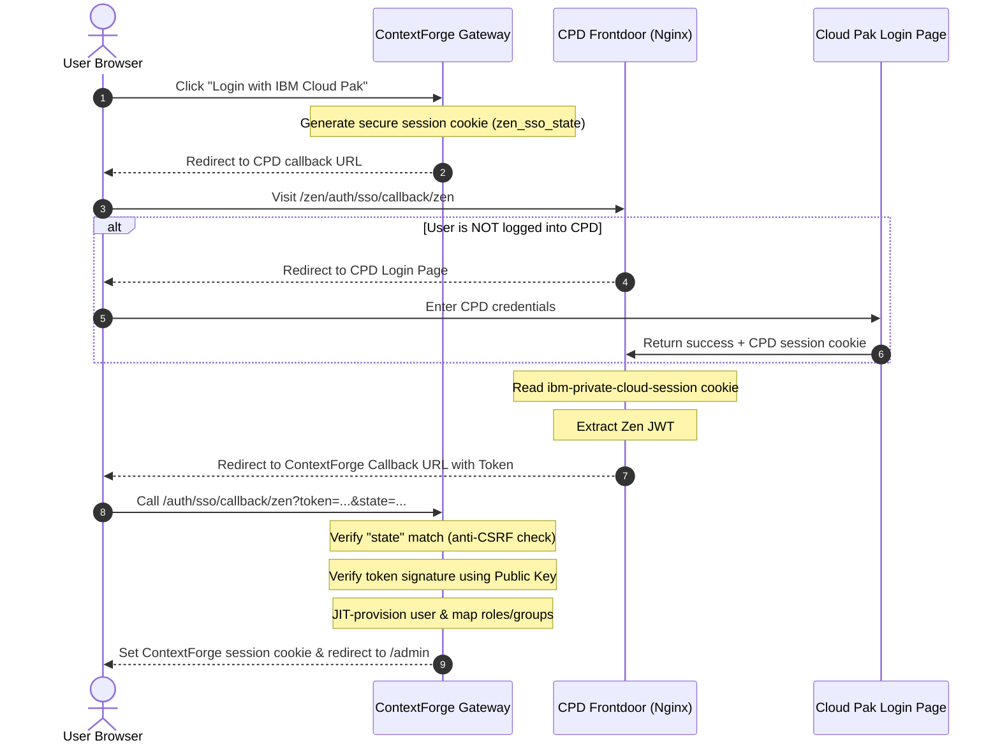

# How to Use IBM Cloud Pak (Zen) with ContextForge

This guide explains how to configure, build, and deploy ContextForge (CF) with IBM Cloud Pak (Zen) Single Sign-On (SSO) integration enabled on any Red Hat OpenShift or Kubernetes cluster.

---

## 1. Prerequisites

Before starting, ensure you have:
* Access to your Red Hat OpenShift cluster via `oc login` (or standard Kubernetes via `kubectl`).
* Administrator access to your Cloud Pak for Data or Cloud Pak for Automation (CPD) deployment.
* **Helm CLI** and **Docker** (or Podman) installed locally.

---

## 2. Step 1: Handle the Zen JWT Public Key Secret

To verify the cryptographic signature of the Zen JWTs issued by CPD, ContextForge must access the Zen JWT public key. This key is stored in an OpenShift/Kubernetes Secret named `zen-jwt-public-key`.

How you configure this secret depends on your deployment topology:

### Scenario A: Zen and ContextForge are in the SAME namespace (Recommended)
If ContextForge is deployed in the same namespace as your Cloud Pak (CPD) instance, **no action is required!** 
The secret `zen-jwt-public-key` is already present in your namespace, and the ContextForge Helm chart will automatically mount it in your gateway pods.

---

### Scenario B: Zen and ContextForge are in DIFFERENT namespaces
If ContextForge runs in a separate namespace (e.g., `mcp-gateway`) from your CPD instance (e.g., `cpd`), you must copy the secret across namespaces.

To safely clone the secret from your CPD namespace into your ContextForge namespace, execute this single command:

```bash
# Clone the secret across namespaces
oc get secret zen-jwt-public-key -n <cpd-namespace> -o yaml \
  | sed 's/namespace: .*/namespace: <cf-namespace>/' \
  | oc apply -f -
```

*Substitute `<cpd-namespace>` with your active CPD namespace and `<cf-namespace>` with your target ContextForge namespace (e.g., `mcp-gateway`).*

Once copied, the Helm chart will mount the secret automatically.

---

## 3. Step 2: Configure Your Personal Deployment Values

To ensure that your personal cluster endpoints and credentials are never tracked or committed to Git, I used a decoupled, local-only configuration setup.

Create the following two files in the root of your workspace:

### File A: `.env.local` (Root)
Stores your personal cluster targets. The deployment script automatically reads this file to configure its registry and namespace targets:

```bash
# Target namespace for ContextForge deployment
NAMESPACE="cp4a"

# Target deployment name
DEPLOYMENT="mcp-gateway-mcp-stack-mcpgateway"

# Custom image tag
IMAGE_TAG="zen-jwt-v8"

# Your OpenShift Image Registry external hostname
OCP_REGISTRY="default-route-openshift-image-registry.apps.xxx.cp.fyre.ibm.com"
```

### File B: `charts/mcp-stack/values-personal.yaml`
Stores your personal domain endpoints for the gateway's SSO configuration. The deployment script automatically merges this with the default `values.yaml` during execution:

```yaml
# Personal cluster configuration overrides for mcp-stack Helm chart
mcpContextForge:
  config:
    SSO_ENABLED: "true"
    SSO_ZEN_ENABLED: "true"
    SSO_ZEN_CPD_HOST: "cpd-mcp-gateway.apps.manutiss.cp.fyre.ibm.com"
    SSO_ZEN_CF_CALLBACK_BASE: "https://mcp-gateway.apps.manutiss.cp.fyre.ibm.com"
    SSO_ZEN_EMAIL_DOMAIN: "cpd.local"
    SSO_ZEN_DEFAULT_ROLE: "viewer"
    # Optional: Map your CPD LDAP/user groups to ContextForge roles
    SSO_ZEN_ROLE_MAPPINGS: '{"Administrator": "platform_admin", "Developers": "developer"}'

zen:
  enabled: true
  cpdHost: "cpd-mcp-gateway.apps.xxxx.cp.fyre.ibm.com"
  cfHost: "mcp-gateway.apps.xxxx.cp.fyre.ibm.com"
  namespace: "cp4ba"
```

---

## 4. Step 3: Build & Deploy ContextForge

We have provided a fully automated, multi-cluster deployment script **[`./scripts/deploy-zen.sh`](./scripts/deploy-zen.sh)**. 

To build your custom container image, push it to your registry, run the Helm upgrade, and patch your deployment, simply run:

```bash
./scripts/deploy-zen.sh
```

### What the deploy script does automatically:
1. **Loads Overrides**: Sourses `.env.local` to override standard namespace/registry defaults.
2. **Builds Container**: Compiles the local Python/ContextForge code into a lightweight container image.
3. **Pushes Image**: Logs in and pushes the built image directly to your `OCP_REGISTRY`.
4. **Triggers Helm**: Detects your `values-personal.yaml` file and automatically triggers:
   ```bash
   helm upgrade --install mcp-gateway charts/mcp-stack \
     -f charts/mcp-stack/values.yaml \
     -f charts/mcp-stack/values-personal.yaml \
     -n mcp-gateway
   ```
5. **Rollout Verification**: Patches the deployment's image tag and watches the rollout status until your pods are healthy.

---

## 5. How the Authentication Flows

For browser-based login, your CPD frontdoor (Nginx) redirects requests to ContextForge.



---

## 6. Local Development & Token Paste Page

If you are developing locally, you do not have the CPD Nginx routing extension.
You can use the built-in **token-paste page** (active only when `ENVIRONMENT=development`):

1. Open `http://localhost:8000/auth/sso/login/zen/token` in your browser.
2. Log into your Cloud Pak for Data instance in another tab.
3. Open your browser Developer Tools (F12) → **Application/Storage** → **Cookies** → select your CPD domain.
4. Copy the value of the `ibm-private-cloud-session` cookie.
5. Paste it on the ContextForge token-paste page and click **Login**.

Alternatively, fetch the token via the command-line:
```bash
curl -sk -X POST https://<YOUR_CPD_HOST>/icp4d-api/v1/authorize \
  -H 'Content-Type: application/json' \
  -d '{"username":"admin","password":"<YOUR_CPD_PASSWORD>"}' | python3 -m json.tool
```

